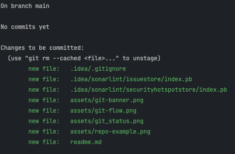
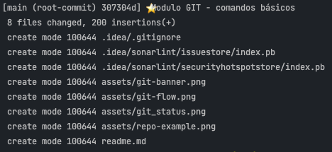

<h1 align="center">
  
</h1>

# Git e Github

Turma Online on26 | python | Semana 1 | 2023 | Professora Beatriz Ramerindo

### Instruções
Antes de começar, vamos organizar nosso setup.
* Fork esse repositório 
* Clone o fork na sua máquina (Para isso basta abrir o seu terminal e digitar `git clone url-do-seu-repositorio-forkado`)
* Entre na pasta do seu repositório (Para isso basta abrir o seu terminal e digitar `cd nome-do-seu-repositorio-forkado`)

## Resumo

- [Terminal](#linha-de-comando--terminal-)
- [Git](#git)
- [Github](#github)

## Combinados

👋🏽 Levante a mão caso tenha dúvida ( também é valido anotar para não esquecer)

🚰 Não se esqueca da garrafinha d'água

❌ Respeite as colegas

⚠️ Toda dúvida é importante e fofocas no chat 💅🏽


## Terminal

A linha de comando é uma interface de texto que possibilita aos usuários interagirem com um computador através da digitação de comandos.

Através do terminal, os usuários podem executar diversas tarefas, como navegar pelo sistema de arquivos, criar, copiar e mover arquivos e pastas, instalar e desinstalar programas, entre muitas outras operações.
No começo pode parecer dificil de se utilizar, mas no nosso dia a dia é muito necessário e mais rápido que utilizar uma UI.


### Comandos Básicos

#### Navegação


| Comando | Descrição | Exemplo de Uso |
|---------|-----------|----------------|
| `ls`    | Listagem - Exibe o conteúdo do diretório atual. | `ls` |
| `cd`    | Navegação - Muda o diretório atual. | `cd /caminho/do/diretorio` |
| `pwd`    | Pasta atual - Exibe o caminho atual. | `pwd` |


#### Arquivos/Diretorio(pastas)

| Comando | Descrição | Exemplo de Uso |
|---------|-----------|----------------|
| `touch` | Cria um novo arquivo. | `touch novo_arquivo.txt` |
| `cat`   | Exibe o conteúdo de um arquivo. | `cat arquivo.txt` |
| `cp`    | Copia um arquivo ou diretório. | `cp arquivo.txt destino/` |
| `mv`    | Move um arquivo ou diretório. | `mv arquivo.txt destino/` |
| `rm`    | Remove um arquivo ou diretório. | `rm arquivo.txt` ou `rm -r pasta/` |


#### Outros

| Comando | Descrição | Exemplo de Uso |
|---------|-----------|----------------|
| `help`  | Mostra a ajuda para um comando. | `help cd` ou `help ls` |
| `clear` | Limpa a tela do terminal. | `clear` |
| `echo`  | Exibe uma mensagem na tela ou redireciona para um arquivo. | `echo "Olá, mundo!"` ou `echo "Texto" > arquivo.txt`


## Git

O Git é um sistema de controle de versão criado por Linus Torvalds, o mesmo criador do Linux.
Ele surgiu em resposta às limitações das ferramentas de versionamento disponíveis na época.
Com o Git, é possível desenvolver projetos de forma colaborativa, permitindo que várias pessoas trabalhem simultaneamente no mesmo código.
Cada alteração feita no arquivo, seja uma modificação, criação ou remoção, é monitorada pelo Git.

Uma das maiores vantagens do Git é o histórico detalhado que ele proporciona para todo o projeto.
Essa característica é extremamente útil para a resolução de bugs e para compreender em qual ponto específico ocorreu uma grande mudança no sistema.
Cada desenvolvedor é responsável por definir as mensagens que descrevem o que foi feito em cada commit.
É essencial seguir as boas práticas de commits semânticos para garantir que nosso histórico seja coerente e reflete adequadamente a evolução do projeto.
Dessa forma, todos os membros da equipe podem acompanhar o progresso e entender as alterações realizadas ao longo do tempo, tornando o trabalho colaborativo mais eficiente e organizado.

Fazendo um paralelo com o nosso dia a dia atual, temos o Google Docs, que permite que várias pessoas trabalhem simultaneamente no mesmo documento e com controle de versões.


Também é possível paralelizar o trabalho por meio de branches, o que é extremamente útil, especialmente quando desejamos ter controle sobre o lançamento de novas funcionalidades,
assim como para criar uma cópia do sistema para testes internos.
Utilizar branches no Git permite que diferentes desenvolvedores trabalhem em tarefas distintas de forma independente, sem afetar o código principal do projeto.

### Repositório (Código Fonte)


### Branch(ramificação)


### Instalação

💾 [Download](https://git-scm.com/)

🎬 [Video de Apoio](https://www.youtube.com/watch?v=vkpxf57cngo)

<u>Importante!!!</u> Para quem possui **Linux** ou **MacOs** o git já vem instalado por padrão.

### ⚙️Configuração

#### Configurando o usuário

```bash
# Define o nome que será usado no commit
git config --global user.name "Seu Nome"

# Define o email utilizado no github
git config --global user.email "seu.email@exemplo.com"
```
#### Configurando o git

```bash
# Define a branch padrão como main
git config --global init.defaultBranch main

# Definir o nano como editor padrão
git config --global core.editor "nano"

```

#### Visualizando as configurações

```bash
    # visualiza a configuração para o repósitório atual
    git config --list 
    
    # visualiza a configuração `padrão` para todos os repositórios
    git config --global --list
```

### Git - Comandos Básicos

#### Resumo

#### Comandos

| Comando      | Descrição                                                | Exemplo de Uso             |
|--------------|----------------------------------------------------------|----------------------------|
| `status`     | Exibe o estado atual do repositório Git.                 | `git status`               |
| `add`    | Adiciona as alterações dos arquivos ao índice.           | `git add arquivo.txt`      |
| `commit` | Cria um novo commit contendo as alterações adicionadas.  | `git commit -m "Mensagem"` |
| `push`   | Envia os commits locais para o repositório remoto.       | `git push origin main`     |

1. `git status`:
   - Descrição: Exibe o estado atual do repositório Git, mostrando as alterações pendentes e o status de arquivos.
   - Exemplo de Uso:
     ```
     git status
     ```

2. `git add`:
   - Descrição: Adiciona as alterações dos arquivos ao índice para que possam ser incluídas no próximo commit.
   - Exemplo de Uso:
     ```
     git add .
     ```

3. `git commit`:
   - Descrição: Cria um novo commit contendo as alterações adicionadas ao índice. **IMPORTANTE!!!** Lembre-se de adiconar uma mensagem descritiva para o commit.
   - Exemplo de Uso:
     ```
     git commit -m "⭐Modulo GIT - comandos básicos"
     ```

4. `git push`:
   - Descrição: Envia os commits locais para o repositório remoto (github no nosso caso).
   - Exemplo de Uso:
     ```bash
     git push origin main
     ```
     (O comando acima envia os commits da branch "main" para o repositório remoto chamado "origin".)

5. `git checkout -b nome_da_branch`:
   - Cria uma branch e alterna para ela
   - Exemplo de uso
      ```bash
      git checkout -b beatriz
      ```
(O comando acima cria e altera da branch "main" para branch "beatriz")

6. `git checkout nome_da_branch`
   - Alterna para uma branch
   - Exemplo de uso

      ```bash
      git checkout main
      ```
(O comando acima muda branchc "beatriz" para branch "main")

7. `git branch`
- Faz as listagens de todas as branchs
   - Alterna para uma branch
   - Exemplo de uso

      ```bash
      git branch
      ```
8. `git pull <origem> branch `
- Atualiza a branch atual com as alteracoes do repositorio remoto
-
  ```bash
  git pull origin main
  ```
9. `git clone  git clone <repositorio>`
- Baixa um repositorio remoto
   ```bash
    git clone <repositorio>
    ```
  (o comando acima baixa um repósito remoto para a sua maquina)

10. - `git remote add origin https://github.com/<seu_usuario>/seu_repositorio.git
- Adiciona um repositorio remoto
```bash
git remote add origin 
```
(O comando acima adiciona um alias com o nome `origin` para a url remota, nesse caso o github  )

### Github

O GitHub é uma plataforma de hospedagem remota de repositórios (código-fonte) e colaboração para o desenvolvimento de projetos.
Lançado em 2008, hoje ele se tornou uma das principais plataformas para desenvolvedores.
Sendo baseado no Git, o GitHub oferece uma gestão altamente eficiente de projetos, facilitando a colaboração entre equipes tanto em projetos privados quanto em projetos públicos, que podem ser open source (gratuitos) ou pertencer a comunidades.

Graças ao GitHub, desenvolvedores podem compartilhar seus códigos, acompanhar alterações, abrir problemas (issues) e colaborar uns com os outros de forma transparente.
A plataforma fornece um ambiente robusto para o trabalho colaborativo em equipe, incentivando a revisão de código, a contribuição aberta e a disseminação do conhecimento.

O GitHub é muito valorizado no mundo do desenvolvimento de software por permitir que projetos sejam versionados e controlados de maneira sólida e organizada. Além disso, ele oferece ferramentas que auxiliam no gerenciamento de projetos, como integração contínua, automação de testes e integração com diversas outras ferramentas e serviços.

Como resultado, o GitHub desempenha um papel essencial na comunidade de desenvolvedores, impulsionando a colaboração global e o crescimento de projetos inovadores. Sua natureza inclusiva e amigável ao código aberto tornou-o uma plataforma vital para desenvolvimento de software em todas as escalas.


### fork

O termo "fork", ou traduzindo para "garfo" ou até mesmo "cópia", é um recurso que permite criar uma cópia de um repositório existente e associá-lo à sua própria conta. Essa funcionalidade é amplamente utilizada para contribuição em projetos open source.

Ao fazer um fork de um projeto open source, você cria uma cópia independente desse projeto em sua conta no GitHub. Isso lhe dá a liberdade para realizar alterações no código sem afetar o repositório original.

Após fazer as alterações em seu fork, você pode enviar um "pull request"  ao projeto original, que é uma proposta para que suas mudanças sejam analisadas e, se aprovadas, sejam incorporadas ao projeto principal.

Esse processo é essencial para a colaboração aberta e descentralizada em projetos de código aberto, permitindo que pessoas de diferentes partes do mundo contribuam com melhorias e correções em uma base voluntária.

### pull request
O termo `pull request`(traduzindo: solicitação para contribuir) é amplamente utilizado no ciclo de desenvolvimento de um software;
durante o processo outros desenvolvedores analisa a proposta enviada e dar feedbacks de melhorias;
caso o código proposto esteja coerente com a necessidade do software ele é aceito, caso contrário é recusado.

## Entregável da semana


## Referencias / Materiais complementares

### videos
- Resumo
   - [Código Fonte TV - GIT](https://www.youtube.com/watch?v=za5KWZ5pRag)
   - [Código Fonte TV - GitHub](https://www.youtube.com/watch?v=myQuetgSEsY)
- Guia Prático
   - [Rafaella Ballerini - Parte 1](https://www.youtube.com/watch?v=DqTITcMq68k&pp=ygUDZ2l0)
   - [Rafaella Ballerini - Parte 2](https://www.youtube.com/watch?v=DqTITcMq68k&pp=ygUDZ2l0)
- [Curso Gustavo Guanabara (Gratuito youtube playlist)](https://www.youtube.com/playlist?list=PLHz_AreHm4dm7ZULPAmadvNhH6vk9oNZA)

### turitoriais
- [freeCodeCamp](https://www.freecodecamp.org/news/git-and-github-for-beginners/)
- [Medium](https://medium.com/blacktech/introdu%C3%A7%C3%A3o-%C3%A0-introdu%C3%A7%C3%A3o-ao-git-3557cab647b9)

### documentações
- [Documentação oficial](https://git-scm.com/docs/git#_git_commands)


<p align="center">
Desenvolvido com :purple_heart:  
</p>

