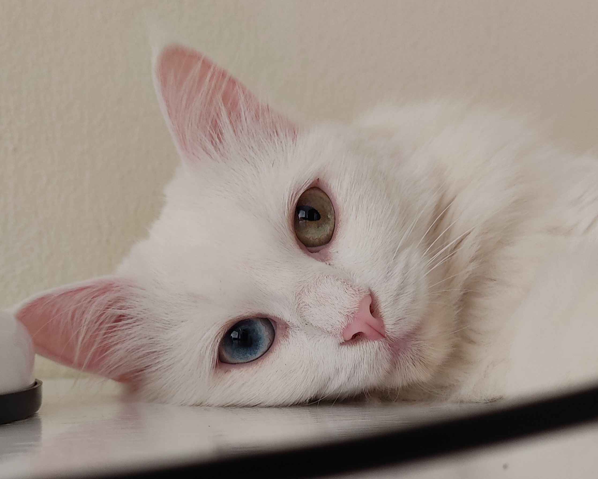

### Como pentear **Gazela**

1. Pegar o pente;
1. Procurar Gazela pela casa;
1. Ao encontrá-la, sentar junto a ela;
1. Oferecer o pente para ela cheirar;
1. Se ela quiser, deixar moder o pente;
1. Fazer carinho na cabeça e no pescoço;
1. Se ela pedir, fazer carinho na barriga;
1. Quando ela estiver felizinha, começar a pentear pelo rosto, depois corpo e rabo;
1. Jamais pentear a barriga a as patinhas;
1. Depois de pentear, limpar os pelos que ficaram presos no pente;
1. Descartar os pelos no lixo;
1. Guardar o pente;
1. Pegar o recipente de petiscos;
1. Procurar Gazela;
1. Ao eencontrá-la, fazer carinho;
1. Oferecer petiscos;
1. Guardar o recipente de petiscos.