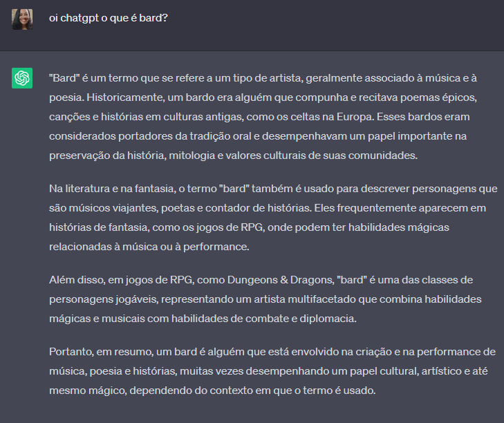
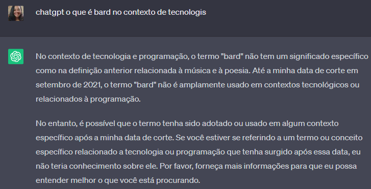

# Para Casa - Semana 1 - Marianna Carvalho - https://github.com/maricarvi

## ChatGPT ou Bard ajudam ou atrapalham os iniciantes em programação?

ChatGPT e Bard (que é um "ChatGPT da Google"), são chatbots que são capazes de realizar pesquisas em um banco de dados muito extenso e compilar de forma refinada as respostas em acordo com o prompt recebido. 

Acredito portanto que o ChatGPT/Bard pode auxiliar um estudante de programação que saiba formular prompts de pesquisa bem direcionados, no sentido de que o ChatGPT/Bard economizariam um tempo de pesquisa e de compreensão e compilação dos dados pesquisados, trazendo uma informação mais "certeira" para a resposta da dúvida em questão e em uma liguagem de fácil compreensão. 

No entanto, estes chatbots são bots e portanto, ao receberem um input mal direcionado ou de certa forma nebuloso, podem nos trazer respostas inúteis e aleatórias para o contexto. 

### A título de exemplo, ao iniciar esta tarefa precisei pesquisar o que seria Bard pois ainda não tinha ouvido falar e pensei "por que não pesquisar pelo próprio chatGPT?". Assim se deu a troca entre mim (uma iniciante confusa e com pouca informação sobre o meu tema de pesquisa) e o chatgpt (um chatbot que foi mal direcionado e que provavelmente está programado para não fazer propaganda de um concorrente):

## 1 
## 2 

Desta forma, podemos concluir que a utilidade da ferramenta (como costuma ser) será definida pela expertise da pessoa que estiver utilizando esta ferramenta. 

Ou seja, um chatbot de pesquisa pode receber um código e "revisá-lo" de acordo com as respostas do banco de dados, pode receber um prompt de um algoritmo sugerido e apresentar uma sugestão de um código para execução do algoritmo, pode esclarecer conceitos fazendo um compilado de definições sobre este conceito e apresentando uma resposta mais acessível... Ou pode apresentar respostas completamente aleatórias ou desatualizadas quanto a um certo tópico pesquisado.